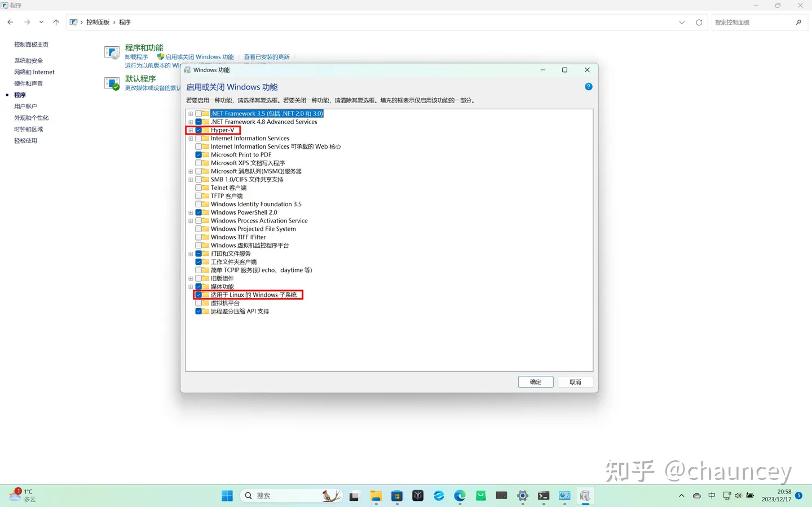
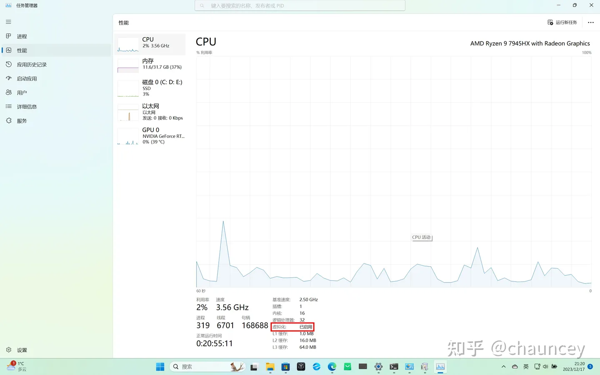
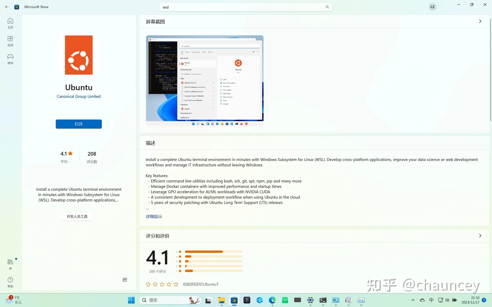
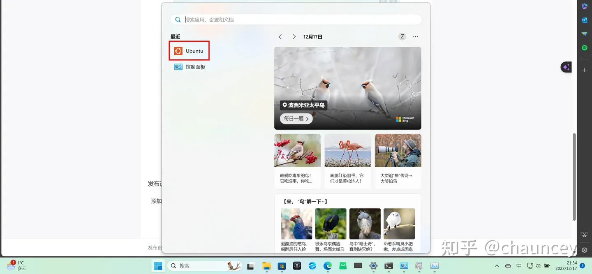
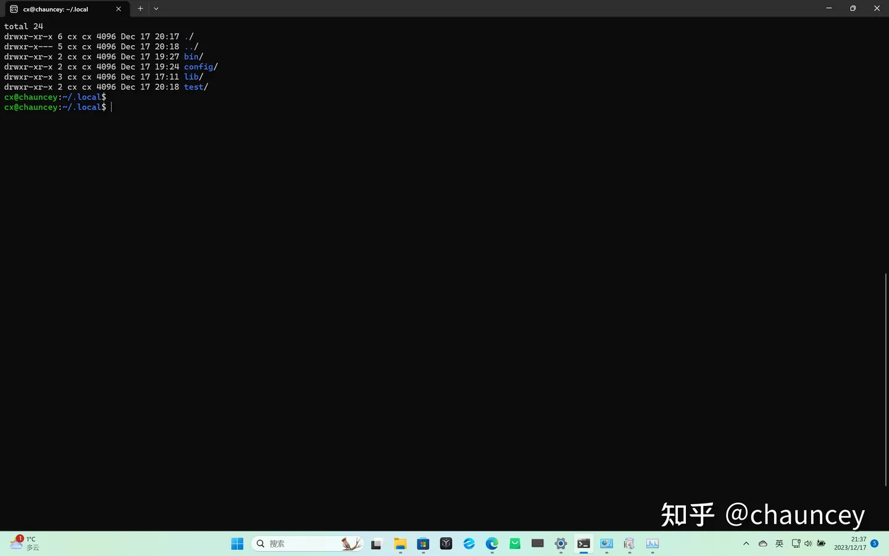

# windows11安装wsl2
##一、安装wsl
要想在windows11家庭版中安装wsl2，首先要在启用和关闭Windows功能中，勾选适用于linux的Windows子系统和Hyper-V，（勾选完后要重启）如下图：



在家庭版中，没有Hyper-V这个选项，不要着急，我们可以通过以下方法安装这个虚拟化程序。

首先要确保您的cpu已经虚拟化，如果还没有那么进入bios设置一下



如果cpu已经如图二那样虚拟化了，那么我们来安装Hyper-V：

```angular2html
pushd “%~dp0”

dir /b %SystemRoot%\servicing\Packages*Hyper-V*.mum >hyper-v.txt

for /f %%i in (‘findstr /i . hyper-v.txt 2^>nul’) do dism /online /norestart /add-package:"%SystemRoot%\servicing\Packages%%i"

del hyper-v.txt

Dism /online /enable-feature /featurename:Microsoft-Hyper-V-All /LimitAccess /ALL
```
复制以上代码到一个文本文件中，并改后缀bat，运行这个可执行文件来安装。

##二、升级wsl到wsl2

根据系统下载升级包进行更新

x64: https://wslstorestorage.blob.core.windows.net/wslblob/wsl_update_x64.msi

arm64：https://wslstorestorage.blob.core.windows.net/wslblob/wsl_update_arm64.msi

##三、选择linux分发版本

在Microsoft store中选择一个版本安装



安装完成后，点击打开使用，第一次打开需要等若干分钟




